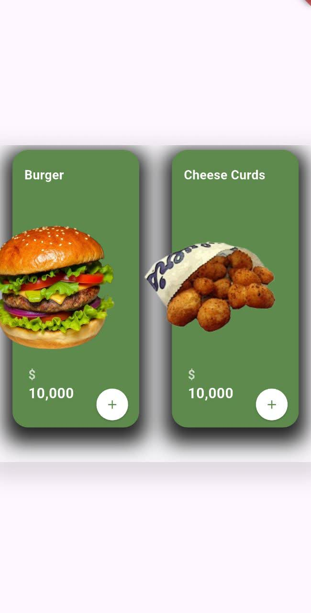
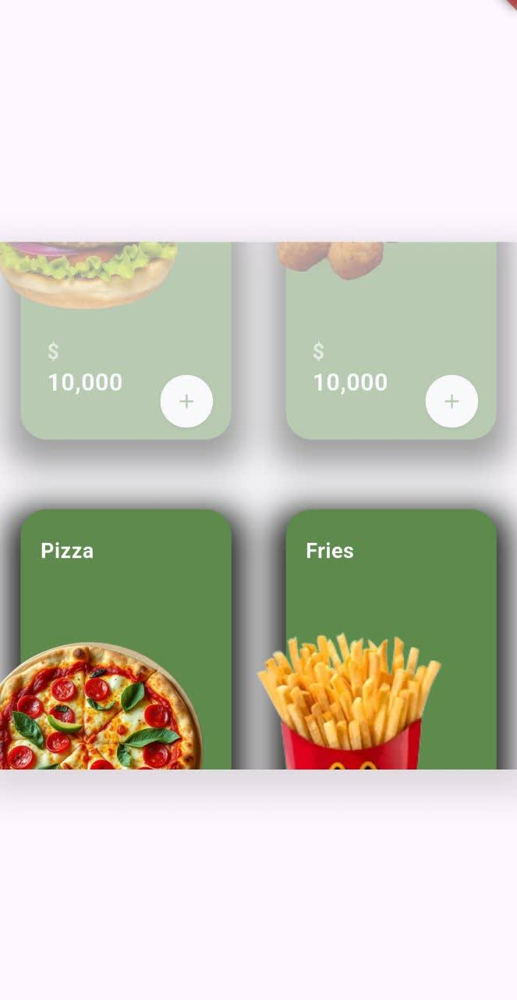
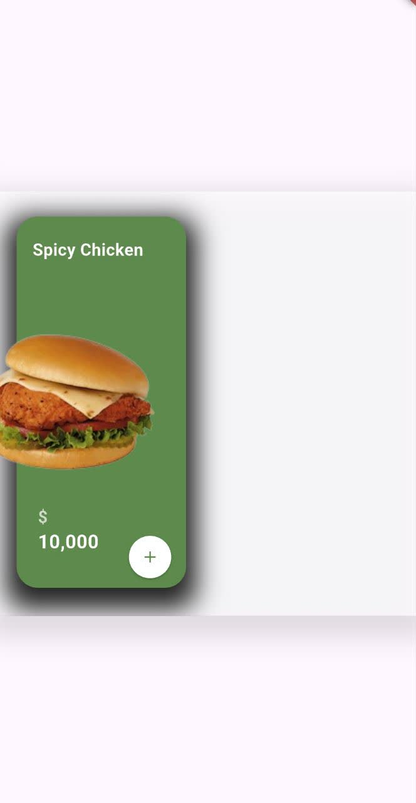
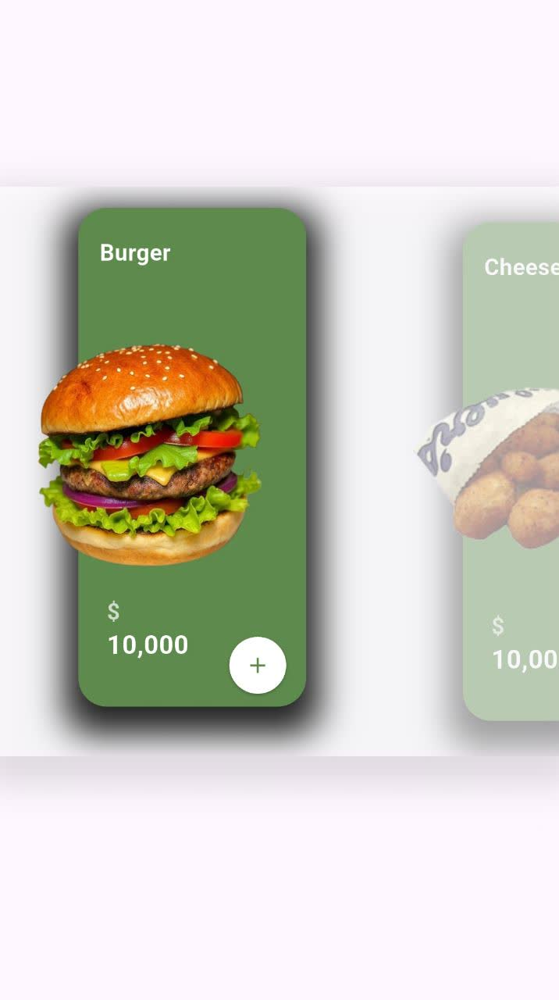
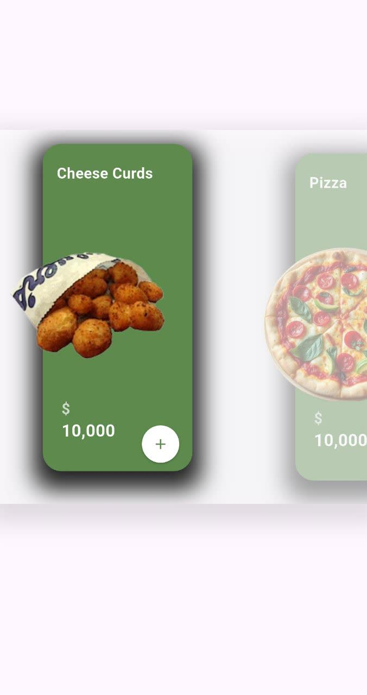
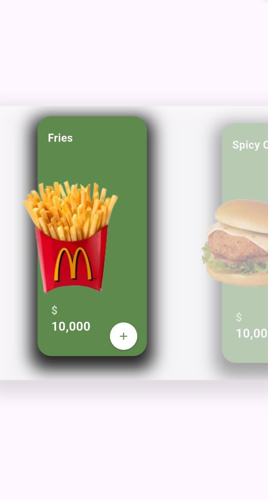
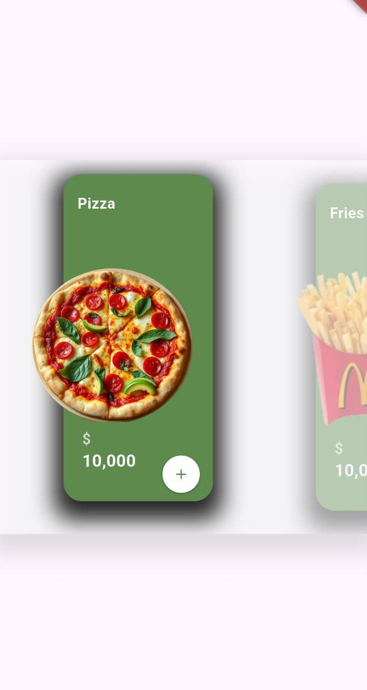

## List Foods Package
this package for show beautiful list from foods.
<h1>Screens</h1>
<p></p>
<div align="center">
<div>

&nbsp;&nbsp;&nbsp;&nbsp; &nbsp;&nbsp;&nbsp;&nbsp;

</div>
 <p></p>
  <div> 

&nbsp;&nbsp;&nbsp;&nbsp; &nbsp;&nbsp;&nbsp;&nbsp;

  </div>
 <p></p>
 <div>

&nbsp;&nbsp;&nbsp;&nbsp; &nbsp;&nbsp;&nbsp;&nbsp;

 </div>
 <p></p>
  <div>

  </div>
</div>

## Usage

```Dart

class ExecuteCodeForUse extends StatelessWidget {
  const ExecuteCodeForUse({super.key});

  void foodCardController(FoodCardController controller) {
    print(
      "${controller.foodName} , ${controller.price} , ${controller.currency.currency} ",
      /// get image for use => controller.foodImage.image
    );
  }

  @override
  Widget build(BuildContext context) {
   
    List<FoodCard> listFood = [
      FoodCard(
        foodName: "Burger",
        foodImage: ImageFoods.burger,
        price: "10",
        currency: CurrencyFood.dollar,
        listen: foodCardController,
      ),
      FoodCard(
          foodName: "French Fries",
          foodImage: ImageFoods.frenchFries,
          price: "10",
          currency: CurrencyFood.dollar,
          listen: foodCardController),
      FoodCard(
          foodName: "Double Double\nBurger",
          foodImage: ImageFoods.doubleDouble,
          price: "10",
          currency: CurrencyFood.dollar,
          listen: foodCardController),
      FoodCard(
          foodName: "Chicken Sandwich",
          foodImage: ImageFoods.chickenSandwich,
          price: "10",
          currency: CurrencyFood.dollar,
          listen: foodCardController),
      FoodCard(
          foodName: "Pizza",
          foodImage: ImageFoods.pizza,
          price: "10",
          currency: CurrencyFood.dollar,
          listen: foodCardController),
      FoodCard(
          foodName: "Noodle",
          foodImage: ImageFoods.noodle,
          price: "10",
          currency: CurrencyFood.dollar,
          listen: foodCardController),
      FoodCard(
          foodName: "HotDog",
          foodImage: ImageFoods.hotDog,
          price: "10",
          currency: CurrencyFood.dollar,
          listen: foodCardController),
      FoodCard(
          foodName: "Filet O\nFish",
          foodImage: ImageFoods.filetOFish,
          price: "10",
          currency: CurrencyFood.dollar,
          listen: foodCardController),
      FoodCard(
          foodName: "Steak Burger",
          foodImage: ImageFoods.steakBurger,
          price: "10",
          currency: CurrencyFood.dollar,
          listen: foodCardController),
      FoodCard(
          foodName: "Spicy Chicken",
          foodImage: ImageFoods.spicyChicken,
          price: "10",
          currency: CurrencyFood.dollar,
          listen: foodCardController),
      FoodCard(
          foodName: "Blizzard",
          foodImage: ImageFoods.blizzard,
          price: "10",
          currency: CurrencyFood.dollar,
          listen: foodCardController),
      FoodCard(
          foodName: "Salad",
          foodImage: ImageFoods.salad,
          price: "10",
          currency: CurrencyFood.dollar,
          listen: foodCardController),
      FoodCard(
          foodName: "Animal Style\nBurger",
          foodImage: ImageFoods.animalStyleBurger,
          price: "10",
          currency: CurrencyFood.dollar,
          listen: foodCardController),
      FoodCard(
          foodName: "Animal Style\nFries",
          foodImage: ImageFoods.animalStyleFries,
          price: "10",
          currency: CurrencyFood.dollar,
          listen: foodCardController),
      FoodCard(
          foodName: "Baked Apple\nPie",
          foodImage: ImageFoods.bakedApplePie,
          price: "10",
          currency: CurrencyFood.dollar,
          listen: foodCardController),
      FoodCard(
          foodName: "BigMac",
          foodImage: ImageFoods.bigMac,
          price: "10",
          currency: CurrencyFood.dollar,
          listen: foodCardController),
      FoodCard(
          foodName: "Biscuits",
          foodImage: ImageFoods.biscuits,
          price: "10",
          currency: CurrencyFood.dollar,
          listen: foodCardController),
      FoodCard(
          foodName: "Cheese Curds",
          foodImage: ImageFoods.cheeseCurds,
          price: "10",
          currency: CurrencyFood.dollar,
          listen: foodCardController),
      FoodCard(
          foodName: "Cheesy Gordita\nCrunch",
          foodImage: ImageFoods.cheesyGorditaCrunch,
          price: "10",
          currency: CurrencyFood.dollar,
          listen: foodCardController),
      FoodCard(
          foodName: "Cherry Limeade",
          foodImage: ImageFoods.cherryLimeade,
          price: "10",
          currency: CurrencyFood.dollar,
          listen: foodCardController),
      FoodCard(
          foodName: "Chicken1",
          foodImage: ImageFoods.chicken1,
          price: "10",
          currency: CurrencyFood.dollar,
          listen: foodCardController),
      FoodCard(
          foodName: "Chicken2",
          foodImage: ImageFoods.chicken2,
          price: "10",
          currency: CurrencyFood.dollar,
          listen: foodCardController),
      FoodCard(
          foodName: "Chicken Biscuit",
          foodImage: ImageFoods.chickenBiscuit,
          price: "10",
          currency: CurrencyFood.dollar,
          listen: foodCardController),
      FoodCard(
          foodName: "Chicken Fingers",
          foodImage: ImageFoods.chickenFingers,
          price: "10",
          currency: CurrencyFood.dollar,
          listen: foodCardController),
      FoodCard(
          foodName: "Chicken Nugget",
          foodImage: ImageFoods.chickenNugget,
          price: "10",
          currency: CurrencyFood.dollar,
          listen: foodCardController),
      FoodCard(
          foodName: "Chicken Quesadilla",
          foodImage: ImageFoods.chickenQuesadilla,
          price: "10",
          currency: CurrencyFood.dollar,
          listen: foodCardController),
      FoodCard(
          foodName: "Chicken Tenders",
          foodImage: ImageFoods.chickenTenders,
          price: "10",
          currency: CurrencyFood.dollar,
          listen: foodCardController),
      FoodCard(
          foodName: "Crunchy Shell\nTacos",
          foodImage: ImageFoods.crunchyShellTacos,
          price: "10",
          currency: CurrencyFood.dollar,
          listen: foodCardController),
      FoodCard(
          foodName: "Curly Fries",
          foodImage: ImageFoods.curlyFries,
          price: "10",
          currency: CurrencyFood.dollar,
          listen: foodCardController),
      FoodCard(
          foodName: "Double Shack\nBurger",
          foodImage: ImageFoods.doubleShackBurger,
          price: "10",
          currency: CurrencyFood.dollar,
          listen: foodCardController),
      FoodCard(
          foodName: "Egg Mc Muffin",
          foodImage: ImageFoods.eggMcMuffin,
          price: "10",
          currency: CurrencyFood.dollar,
          listen: foodCardController),
      FoodCard(
          foodName: "Fries",
          foodImage: ImageFoods.fries,
          price: "10",
          currency: CurrencyFood.dollar,
          listen: foodCardController),
      FoodCard(
          foodName: "Frosty",
          foodImage: ImageFoods.frosty,
          price: "10",
          currency: CurrencyFood.dollar,
          listen: foodCardController),
      FoodCard(
          foodName: "Glazed Doughnut",
          foodImage: ImageFoods.glazedDoughnut,
          price: "10",
          currency: CurrencyFood.dollar,
          listen: foodCardController),
      FoodCard(
          foodName: "Hash Browns",
          foodImage: ImageFoods.hashBrowns,
          price: "10",
          currency: CurrencyFood.dollar,
          listen: foodCardController),
      FoodCard(
          foodName: "Honey BBQ\nChicken Sandwich",
          foodImage: ImageFoods.honeyBBQChickenSandwich,
          price: "10",
          currency: CurrencyFood.dollar,
          listen: foodCardController),
      FoodCard(
          foodName: "Mashed Potatos\nAnd Cajun Gravy",
          foodImage: ImageFoods.mashedPotatosAndCajunGravy,
          price: "10",
          currency: CurrencyFood.dollar,
          listen: foodCardController),
      FoodCard(
          foodName: "Mc Flurry",
          foodImage: ImageFoods.mcFlurry,
          price: "10",
          currency: CurrencyFood.dollar,
          listen: foodCardController),
      FoodCard(
          foodName: "Mc Griddle",
          foodImage: ImageFoods.mcGriddle,
          price: "10",
          currency: CurrencyFood.dollar,
          listen: foodCardController),
      FoodCard(
          foodName: "Mc Nuggets",
          foodImage: ImageFoods.mcNuggets,
          price: "10",
          currency: CurrencyFood.dollar,
          listen: foodCardController),
      FoodCard(
          foodName: "Original Chicken\nSandwich",
          foodImage: ImageFoods.originalChickenSandwich,
          price: "10",
          currency: CurrencyFood.dollar,
          listen: foodCardController),
      FoodCard(
          foodName: "Pretzel",
          foodImage: ImageFoods.pretzel,
          price: "10",
          currency: CurrencyFood.dollar,
          listen: foodCardController),
      FoodCard(
          foodName: "Quarter Pounder",
          foodImage: ImageFoods.quarterPounder,
          price: "10",
          currency: CurrencyFood.dollar,
          listen: foodCardController),
      FoodCard(
          foodName: "Roast Beef\nSandwich",
          foodImage: ImageFoods.roastBeefSandwich,
          price: "10",
          currency: CurrencyFood.dollar,
          listen: foodCardController),
      FoodCard(
          foodName: "Shack Burger",
          foodImage: ImageFoods.shackBurger,
          price: "10",
          currency: CurrencyFood.dollar,
          listen: foodCardController),
      FoodCard(
          foodName: "Soft Tacos",
          foodImage: ImageFoods.softTacos,
          price: "10",
          currency: CurrencyFood.dollar,
          listen: foodCardController),
      FoodCard(
          foodName: "Spicy Chicken\nDeluxe Sandwich",
          foodImage: ImageFoods.spicyChickenDeluxeSandwich,
          price: "10",
          currency: CurrencyFood.dollar,
          listen: foodCardController),
      FoodCard(
          foodName: "Two Tacos",
          foodImage: ImageFoods.twoTacos,
          price: "10",
          currency: CurrencyFood.dollar,
          listen: foodCardController),
      FoodCard(
          foodName: "Whopper",
          foodImage: ImageFoods.whopper,
          price: "10",
          currency: CurrencyFood.dollar,
          listen: foodCardController),
      FoodCard(
          foodName: "Waffle Fries",
          foodImage: ImageFoods.waffleFries,
          price: "10",
          currency: CurrencyFood.dollar,
          listen: foodCardController),
    ];

    /// The itemCount must be equal to the length of the items. otherwise, you w

    return Column(
        spacing: 30,
        children: [
          ListFoodsHorizontal(itemCount: 50, items: listFood, color: Colors.white70),
          ListFoodsVertical(itemCount: 50, items: listFood, color: Colors.white70,),
        ]
    );
  }
}


```


